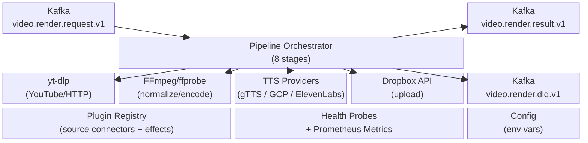
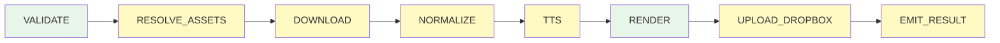
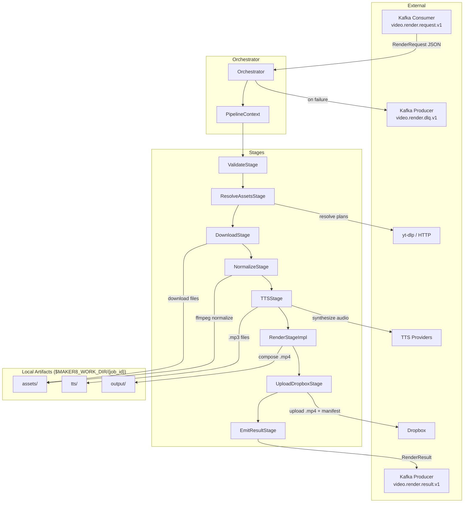
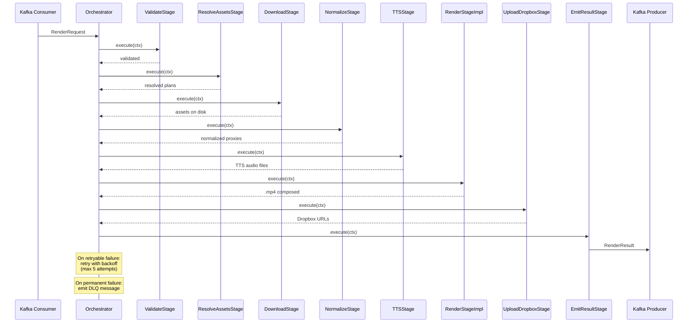
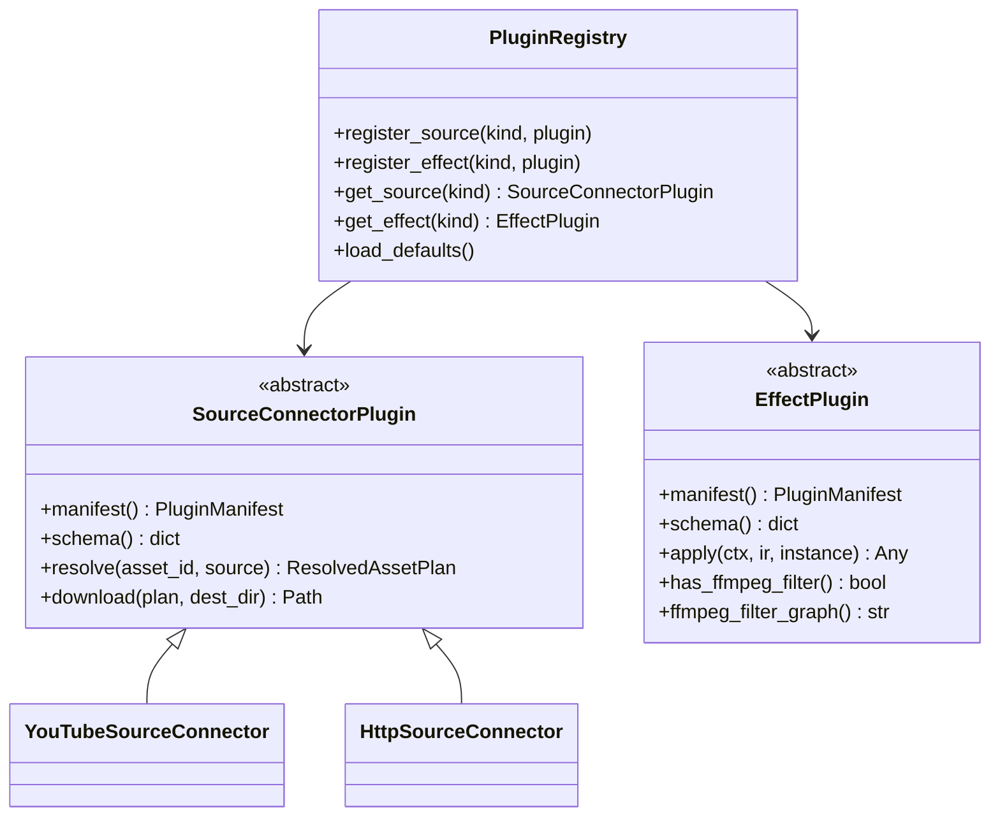

# Maker8 – System Architecture

> **Canonical architecture document.**  
> Last updated: 2026-04-08 (XST-1038).

---

## 1. Overview

Maker8 is a **video rendering pipeline** (Render Worker) that consumes
`RenderRequest` messages from Kafka, executes an 8-stage pipeline to
produce an `.mp4` video, uploads artifacts to Dropbox, and emits a
`RenderResult` back to Kafka.

**Key characteristics:**

- **1 instance = 1 job at a time** (synchronous pipeline).
- Retry with exponential back-off for retryable stages.
- DLQ for exhausted retries or non-retryable failures.
- Prometheus metrics + health probes for observability.
- Plugin system for source connectors and effects.

---

## 2. System Block Diagram



---

## 3. Pipeline Stages

The pipeline executes 8 stages in strict order. Each stage operates on a
shared `PipelineContext` that carries mutable state between stages.



| # | Stage | Retryable | Description |
|---|-------|-----------|-------------|
| 1 | `VALIDATE` | No | Validate RenderSpec schema, ≥1 scene, asset refs |
| 2 | `RESOLVE_ASSETS` | Yes | Query source plugins for download plans |
| 3 | `DOWNLOAD` | Yes | Execute plugin downloads to local disk |
| 4 | `NORMALIZE` | Yes | FFmpeg normalize/transcode, NVENC with fallback |
| 5 | `TTS` | Yes | Synthesize narration per scene |
| 6 | `RENDER` | No | MoviePy/Pillow video composition |
| 7 | `UPLOAD_DROPBOX` | Yes | Upload .mp4 + manifest to Dropbox |
| 8 | `EMIT_RESULT` | Yes | Publish RenderResult to Kafka |

**Dry-run mode:** When `dry_run=true`, stages 2–7 are skipped. Only
VALIDATE and EMIT_RESULT execute.

---

## 4. Data Flow Diagram



---

## 5. Job Lifecycle Sequence



---

## 6. Retry Policy

| Parameter | Value |
|-----------|-------|
| Max attempts | 5 |
| Min delay | 60 seconds |
| Max delay | 21,600 seconds (6 hours) |
| Jitter factor | 0.1 |
| Back-off formula | `min(60 × 2^(attempt-1), 21600) + jitter` |

**Retryable stages:** RESOLVE_ASSETS, DOWNLOAD, NORMALIZE, TTS,
UPLOAD_DROPBOX, EMIT_RESULT.

**Non-retryable stages:** VALIDATE, RENDER. Failures here send directly
to DLQ.

---

## 7. Kafka Topics

| Topic | Direction | Schema |
|-------|-----------|--------|
| `video.render.request.v1` | **Inbound** | `RenderRequest` (render_contracts) |
| `video.render.result.v1` | **Outbound** | `RenderResult` (models/contracts.py) |
| `video.render.dlq.v1` | **DLQ** | `DLQPayload` (models/contracts.py) |

- Consumer group: `maker8-render`
- Max poll interval: 30 minutes (1,800,000 ms)
- SASL_PLAINTEXT authentication

---

## 8. External Services

| Service | Client | Purpose |
|---------|--------|---------|
| Dropbox | `DropboxClient` | Upload .mp4 + manifest; OAuth2 refresh |
| Google Cloud TTS | `GoogleCloudTTSProvider` | Neural TTS; service-account key rotation |
| ElevenLabs TTS | `ElevenLabsProvider` | Neural TTS; API key rotation |
| gTTS | `GTTSProvider` | Free Google Translate TTS (fallback) |
| yt-dlp | `YouTubeSourceConnector` | Download YouTube videos |
| HTTP | `HttpSourceConnector` | Download direct HTTP URLs |
| FFmpeg/ffprobe | subprocess | Normalize, transcode, probe metadata |

---

## 9. Plugin System



**Built-in source connectors:** `youtube`, `http`

**Built-in effect plugins:** fade, zoom_pan, blur, brightness_contrast,
and others registered in `PluginRegistry.load_defaults()`.

---

## 10. Health & Observability

### Health Probes

| Probe | File | Meaning |
|-------|------|---------|
| Liveness | `/tmp/maker8_live` | Process is alive |
| Readiness | `/tmp/maker8_ready` | Bootstrap complete, consuming |
| Status | `/tmp/maker8_status.json` | JSON snapshot of worker state |

### Prometheus Metrics (port 9108)

**Counters:**
- `maker8_jobs_received_total` — Kafka messages received
- `maker8_jobs_succeeded_total` — Jobs completed successfully
- `maker8_jobs_failed_total{stage, error_code}` — Permanent failures
- `maker8_retries_scheduled_total{stage}` — Retries triggered
- `maker8_dlq_emitted_total{stage}` — DLQ messages sent
- `maker8_subprocess_failures_total{stage, source_kind}` — Process failures

**Histograms:**
- `maker8_job_duration_seconds{status}` — End-to-end job time
- `maker8_stage_duration_seconds{stage, status}` — Per-stage time
- `maker8_tts_duration_seconds{provider}` — TTS synthesis time
- `maker8_download_bytes{source_kind}` — Downloaded asset sizes
- `maker8_scene_render_duration_seconds` — Per-scene render time

**Gauges:**
- `maker8_worker_up` — Process alive (0/1)
- `maker8_worker_ready` — Consuming (0/1)
- `maker8_job_in_progress` — Processing a job (0/1)
- `maker8_current_stage` — Ordinal 0–8 (0 = idle)

---

## 11. Artifact Layout

Each job creates a workspace under `$MAKER8_WORK_DIR/{job_id}/`:

```
{job_id}/
├── assets/          # Downloaded & normalized media files
├── tts/             # Synthesized narration audio (.mp3)
└── output/          # Final composed video (.mp4)
```

---

## 12. Configuration

All settings use the `MAKER8_` environment variable prefix.

| Category | Key Variables |
|----------|--------------|
| Kafka | `MAKER8_KAFKA_BOOTSTRAP_SERVERS`, `MAKER8_KAFKA_GROUP_ID` |
| Dropbox | `MAKER8_DROPBOX_APP_KEY`, `MAKER8_DROPBOX_APP_SECRET`, `MAKER8_DROPBOX_REFRESH_TOKEN` |
| TTS | `MAKER8_TTS_PROVIDER`, `MAKER8_TTS_PRESETS_PATH`, `MAKER8_GG_TTS_KEYS_DIR`, `MAKER8_ELEVENLABS_KEYS_DIR` |
| Rendering | `MAKER8_USE_NVENC`, `MAKER8_PERF_PROFILE`, `MAKER8_PROXY_MAX_SHORT_EDGE` |
| yt-dlp | `MAKER8_YTDLP_AUTO_UPDATE`, `MAKER8_YTDLP_CHANNEL` |
| Metrics | `MAKER8_METRICS_ENABLED`, `MAKER8_METRICS_PORT` |
| Retry | `MAKER8_RETRY_MAX_ATTEMPTS`, `MAKER8_RETRY_MIN_DELAY_SEC` |
| Work dir | `MAKER8_WORK_DIR` |

---

## 13. Source-of-Truth Hierarchy

| File | Authority Scope |
|------|-----------------|
| `render_contracts/render_spec.py` | Wire-format models (shared with editor8) |
| `render_contracts/events.py` | Kafka topic constants |
| `models/common.py` | maker8-internal enums, ErrorInfo, DropboxFileRef |
| `models/contracts.py` | RenderRequest (re-export), RenderResult, DLQPayload |
| `config.py` | All runtime configuration |
| `retry.py` | Retry policy, StageError, retryable stage set |
| `pipeline/orchestrator.py` | Stage ordering and execution flow |
| `plugins/registry.py` | Default plugin registration |
| `config/tts_presets.json` | TTS voice/preset definitions |
| `CONTRACT_FIELD_STATUS.md` | Field lifecycle status tracking |
| `docs/ARCHITECTURE.md` | **This document** — canonical architecture reference |
