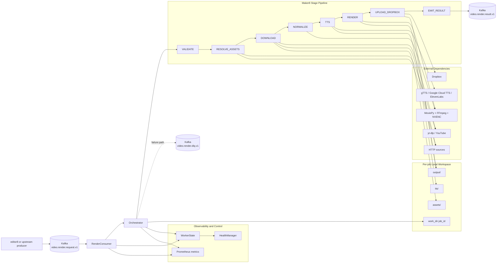

# Maker8 Review 2026-04-07

## Tóm tắt

`maker8` có kiến trúc tương đối rõ: consumer Kafka đồng bộ, orchestrator theo stage, contracts được gom về `render_contracts`, và phần render được tách khỏi pipeline hợp lý. Repo cũng có tư duy survivability tốt: chấp nhận degrade có kiểm soát thay vì fail toàn job ở nhiều tình huống asset/TTS lỗi.

Điểm yếu chính hiện tại nằm ở các đường lỗi và operational semantics: có trường hợp message bị commit mà không còn result/DLQ, timeout TTS không thực sự chặn treo, startup check của Google Cloud TTS mâu thuẫn với chính cơ chế ADC fallback, và render stage đang skip nhầm các scene không có layer hình nhưng vẫn renderable theo contract.

## Findings

### S1. Consumer có thể commit message mà không bảo đảm đã emit `RenderResult` hoặc DLQ

- `RenderConsumer.start()` commit offset sau mọi lần xử lý, kể cả khi `json.loads()` lỗi hoặc handler ném exception: `src/maker8/kafka/consumer.py:123-146`.
- `Orchestrator.handle()` chỉ bọc lỗi ở `RenderRequest.model_validate(payload)`, nhưng `PipelineContext.from_request(...)` chạy ngoài khối `try/except` đó: `src/maker8/pipeline/orchestrator.py:97-115`.
- `PipelineContext.from_request()` có thể ném `ValueError` cho `job_id` không hợp lệ: `src/maker8/pipeline/context.py:98-103`.

Tác động:

- Invalid JSON hiện chỉ được log rồi commit, không thấy DLQ.
- Nếu payload parse được nhưng `job_id` chứa ký tự cấm, consumer vẫn commit offset sau khi handler văng exception, trong khi chưa có `FAILED RenderResult` hay `DLQPayload`.
- Đây là dạng silent message loss, đặc biệt nguy hiểm vì operator nhìn Kafka sẽ thấy message đã qua offset nhưng không có outcome tương ứng.

Khuyến nghị:

- Chỉ commit khi đã xác nhận có terminal outcome rõ ràng.
- Bọc luôn phần tạo `PipelineContext` trong nhánh failure-handling của orchestrator.
- Với poison message ở consumer, emit DLQ tối thiểu thay vì chỉ log.

### S1. Timeout TTS không thực sự chặn treo wall-clock

- `TTSService.synthesize()` dùng `future.result(timeout=timeout_sec)` bên trong `with ThreadPoolExecutor(...)`: `src/maker8/services/tts_client.py:499-514`.

Vấn đề:

- Khi `future.result()` timeout, exception được raise, nhưng ngay sau đó context manager của `ThreadPoolExecutor` sẽ `shutdown(wait=True)`.
- Nghĩa là thread đang treo vẫn có thể bị chờ tới khi xong thật sự. Timeout này vì thế không tạo hard upper bound như comment mô tả.

Tác động:

- Một provider TTS treo ở network/socket level vẫn có thể giữ worker đứng lâu hơn `MAKER8_TTS_TIMEOUT_SEC`.
- Điều này phá giả định retry/backoff và làm worker đồng bộ mất khả năng tiến lên job tiếp theo.

Khuyến nghị:

- Không dùng `ThreadPoolExecutor` context manager với `wait=True` cho hard timeout.
- Chuyển sang subprocess boundary, hoặc executor sống lâu + cancel/best-effort abandon, hoặc timeout native của từng SDK được thực thi ở lớp I/O thực sự.

### S2. Nhánh Google Cloud TTS qua ADC được tài liệu hóa nhưng bị startup check chặn

- `_load_google_key_ring()` nói rõ nếu không có JSON key ring thì provider sẽ fallback sang ADC: `src/maker8/services/tts_client.py:330-345`.
- `GoogleCloudTTSProvider._build_client()` cũng thật sự hỗ trợ ADC khi không có `credentials_path`.
- Nhưng `TTSService.has_provider()` chỉ trả `True` cho `google_cloud` nếu `_google_ring` tồn tại: `src/maker8/services/tts_client.py:412-422`.

Tác động:

- Cấu hình hợp lệ kiểu `MAKER8_TTS_PROVIDER=google_cloud` + `GOOGLE_APPLICATION_CREDENTIALS` hoặc metadata server sẽ bị app exit ngay từ bootstrap.
- Đây là drift giữa code runtime và startup validation, dễ gây sự cố khi deploy trên GCP/Kubernetes.

Khuyến nghị:

- `has_provider()` cần coi ADC là hợp lệ cho `google_cloud`, hoặc ít nhất cho phép startup rồi validate ở lần synthesize đầu tiên bằng lỗi có ngữ cảnh hơn.

### S2. Render stage đang skip nhầm scene narration-only hoặc audio-only

- Contract cho phép `Scene.layers` mặc định là list rỗng: `src/render_contracts/render_spec.py:158-165`.
- Composer vẫn render được scene chỉ có background màu + narration/audio: `src/maker8/rendering/composer.py:593-655`.
- Nhưng `RenderStageImpl.execute()` chỉ coi scene là viable nếu có text layer hoặc layer tham chiếu asset tồn tại: `src/maker8/pipeline/render.py:46-84`.

Tác động:

- Scene hợp lệ theo contract nhưng không có layer hình sẽ bị gắn `SCENE_NO_CONTENT` và bị loại khỏi output.
- Các use case intro/outro chỉ có voice-over trên nền màu hoặc audio-only scene sẽ cho kết quả sai về mặt business.

Khuyến nghị:

- Viability check nên tính cả narration/TTS, audio track hợp lệ, hoặc đơn giản để composer quyết định thay vì pre-filter quá sớm.

### S3. Shutdown cleanup hiện không nhất quán với chính `atexit` hook

- App đăng ký `_atexit()` để `health.cleanup()` và log `app.exiting`: `src/maker8/app.py:139-152`.
- Nhưng đường shutdown chính kết thúc bằng `os._exit(0)`: `src/maker8/app.py:201-204`.

Tác động:

- `os._exit()` bỏ qua `atexit`, nên cleanup đầy đủ không bao giờ chạy ở đường exit bình thường.
- `live` và `ready` được xóa thủ công ở `finally`, nhưng `status.json` vẫn có nguy cơ để lại stale snapshot.
- Đây là vấn đề observability/ops hơn là crash bug, nhưng sẽ làm state on-disk lệch với thực tế process.

Khuyến nghị:

- Nếu cần giữ `os._exit`, hãy cleanup toàn bộ health artifacts ngay trong `finally`.
- Nếu không còn vướng native cleanup, ưu tiên `sys.exit()` sau khi đóng producer/consumer.

### S3. Cách suy ra `ffprobe` từ path `ffmpeg` bằng string replace khá mong manh

- `normalize.py` lấy `ffprobe` bằng `resolve_ffmpeg_binary().replace("ffmpeg", "ffprobe")`: `src/maker8/pipeline/normalize.py:38` và `src/maker8/pipeline/normalize.py:74`.

Tác động:

- Với custom binary path như `/opt/bin/custom-ffmpeg` hoặc path chứa nhiều lần chuỗi `ffmpeg`, kết quả có thể sai.
- Sai path probe sẽ làm logic kiểm tra media hợp lệ hoặc phân biệt audio/video trở nên không đáng tin.

Khuyến nghị:

- Resolve `ffprobe` bằng `Path(ffmpeg).with_name("ffprobe")`, hoặc thêm một resolver riêng song song với FFmpeg runtime.

## Điểm tốt đáng giữ

- Contracts dùng `render_contracts` làm source of truth, giảm drift giữa `editor8` và `maker8`.
- Chia stage rõ ràng, `PipelineContext` dễ lần theo artifact flow.
- Cấu trúc plugin cho source/effect đủ gọn để mở rộng.
- Logging và health/status files tốt hơn mặt bằng nhiều worker nội bộ.
- Hướng degrade có cảnh báo (`warnings`, `failed_assets`, `skipped_scenes`) là thực dụng cho production.

## Sơ đồ Khối Vẽ Lại

## Phạm vi đọc code

- Entrypoint: `src/maker8/app.py`
- Kafka: `src/maker8/kafka/consumer.py`, `src/maker8/kafka/producer.py`
- Orchestration: `src/maker8/pipeline/orchestrator.py`, `context.py`, các stage chính
- Rendering: `src/maker8/rendering/composer.py`, `layers.py`, `encoder.py`, `ffmpeg_runtime.py`
- Services: `src/maker8/services/tts_client.py`, `dropbox_client.py`, `key_ring.py`
- Contracts: `src/render_contracts/render_spec.py`, `src/maker8/models/contracts.py`
- Observability: `src/maker8/observability/*`

## Ghi chú xác minh

- Review này là static review từ code hiện tại trong repo.
- Tôi không chạy được test suite trong environment hiện tại vì `pytest` chưa được cài:
  - `pytest` -> `/bin/bash: pytest: command not found`
  - `python -m pytest` -> `No module named pytest`
