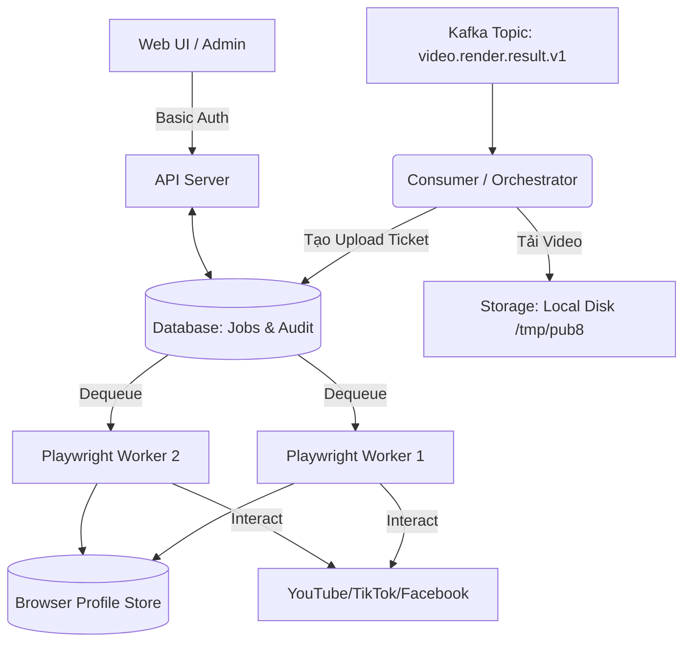

# Publisher8 – Architecture Design & Critique (Phân tích & Phản biện Kiến trúc)

Tài liệu này đi sâu vào việc phân tích, phản biện các quyết định kiến trúc cốt lõi của **Publisher8** – hệ thống tự động tải và cấu hình upload video lên các nền tảng mạng xã hội sử dụng **MCP Playwright**.

---

## 1. Phân tích Luồng Dữ liệu (Data Flow Analysis)

Thay vì tích hợp tính năng Upload trực tiếp vào `maker8`, Publisher8 được thiết kế là một **hệ thống độc lập** giao tiếp qua Kafka.
- **Luồng:** `maker8` -> Kafka (`video.render.result.v1`) -> `Publisher8` -> (Download Dropbox) -> Playwright -> Social Platform.

### Quyết định 1.1: Tách rời (Decoupling) Publisher khỏi Render Worker
- **Phản biện / Lựa chọn thay thế:** Có thể nhét code Playwright vào cuối quy trình của `maker8` ngay sau khi render xong (Stage: UPLOAD_SOCIAL). Việc này tiết kiệm được một lần download từ Dropbox (vì file video đang ở ổ cứng local sau khi render).
- **Quyết định chọn "Tách rời":**
  - **Scale bất đối xứng:** Render video (FFmpeg/MoviePy) tốn rất nhiều CPU/GPU. Trong khi đó, Upload (Playwright) tốn rất nhiều RAM (Browser instance) và có thời gian chờ (idle / network IO) lâu. Tách riêng giúp scale 2 cụm độc lập.
  - **Tỉ lệ rủi ro (Risk isolation):** Render rất hiếm khi lỗi nếu spec đúng. Nhưng Upload UI automation rất dễ lỗi (timeout element, mạng chập chờn, dính CAPTCHA). Nếu gộp chung, một lỗi Upload có thể dẫn đến rớt cả luồng kết quả Render, hoặc code bị side-effect.
  - **Replayability:** Có thể trigger lại luồng upload (từ tin nhắn Kafka) hàng trăm lần mà không phải render lại video từ đầu.

---

## 2. Kiến trúc Core của Publisher8 (Publisher8 Internal Architecture)

Publisher8 chia làm 2 thành phần chính: **Orchestrator** và **Playwright Workers Pool**.

### Quyết định 2.1: Đồng bộ (Sync) vs Bất đồng bộ (Async Queue) trong nội bộ
- **Phản biện:** Khi Consumer nhận message Kafka, nó có thể trực tiếp mở trình duyệt lên chạy luôn.
- **Phân tích:** Một message Kafka từ `maker8` có thể yêu cầu: "Đăng lên Youtube X, Tiktok Y, Facebook Page Z". Nếu tuần tự (Sequential) bật Browser lên upload từng cái, sẽ tốn nhiều thời gian và nghẽn Consumer (bị rebalance Kafka nếu timeout).
- **Quyết định:** Sử dụng Database (Redis hoặc Database RDBMS) như một Queue (Upload Ticket Queue). Consumer Kafka chỉ có nhiệm vụ: tải video từ Dropbox, parse các `publish_targets` và nhét các Ticket (Job con) vào DB. Sau đó, một **Worker Pool** riêng biệt (ví dụ Celery hoặc RQ) sẽ lấy Ticket ra chạy bằng Playwright.

### Quyết định 2.2: UI Dashboard, API và Hệ thống Audit
- **Phân tích:** Hệ thống Auto-upload thường là một cục đen (black-box). Khi video tới đích Kafka mà tạch giữa chừng, người quản trị không theo dõi được. Việc có một **Audit Log DB** kết hợp cùng **UI Dashboard** giúp tăng sự minh bạch. Những video khi đăng lỗi thì cần nút **Trigger Re-Upload** mà không phải gửi lại spec render từ đầu.
- **Quyết định:** 
  - Bổ sung module **API Server** (VD: FastAPI) để đọc/ghi số liệu từ Job DB.
  - Xây dựng **Web UI** (Next.js/React hoặc form SSR) gọi API.
  - Tích hợp Auth siêu tinh gọn (HTTP Basic Auth hoặc 1 tk cấu hình sẵn) cho toàn bộ API và UI để bảo mật, không dùng thiết kế Role-based phức tạp.
  - Các Playwright Worker bổ sung schema `DELETE_POST` nhằm nhận lệnh từ queue khi người dùng click nút Delete video trên Web UI. Thay vì người dùng phải vào tận nền tảng đó để xóa, Worker sẽ mở Playwright lên xóa tự động.

---

## 3. Kiến trúc Quản lý Session & Anti-Detect cho Playwright

Vấn đề lớn nhất của Playwright Automation là bị đăng xuất, mất session, hoặc dính Checkpoint/CAPTCHA.

### Quyết định 3.1: Quản lý Chromium Context (User Data Dir vs Cookies Injection)
- **Giải pháp 1 (Inject Cookies):** Chỉ lưu danh sách Cookies (JSON) vào DB. Khi bật trình duyệt trắng tinh (Incognito), tiêm (inject) Cookies vào. 
  - *Nhược điểm:* Rất dễ bị phát hiện. Facebook và Google có cơ chế check Fingerprint trình duyệt. Nếu Fingerprint thay đổi liên tục nhưng IP và Cookies giữ nguyên, khả năng dính Checkpoint (Xác minh danh tính) là 99%.
- **Giải pháp 2 (BrowserContext persistent - User Data Directory):** Lưu lại TOÀN BỘ thư mục profile của Chromium. 
  - *Nhược điểm:* Nặng (một folder profile có thể chiếm 50-200MB lưu cache).
  - *Ưu điểm:* Giữ vững Fingerprint, local storage, extensions, service workers. Hệ thống các mạng xã hội tin tưởng trình duyệt này vì nó có vẻ "quen thuộc".
- **Quyết định:** Dùng Persistent Context (`browser_type.launch_persistent_context()`) trỏ vào một thư mục được mã hóa hoặc mount từ S3/EFS xuống. Mỗi tài khoản MXH có một UUID Profile riêng.

### Quyết định 3.2: Chống phát hiện Bot (Anti-Detect)
- Playwright mặc định bị lộ biến `navigator.webdriver = true`. Chạy Headless thuần túy (không GUI) thường bị các nền tảng quét Fingerprint nhận diện là Bot do thiếu hardware acceleration và kích thước màn hình bất thường.
- **Giải pháp kỹ thuật đề xuất:** 
  - Phải gắn proxy động theo từng Profile (Profile A luôn dùng Proxy IP Mỹ quốc, Profile B dùng Proxy VN).
  - Bắt buộc dùng wrapper như `playwright-stealth` (Python) hoặc môi trường ngụy trang tương đương (như *undetected_chromedriver* nếu chuyển sang Selenium, nhưng Playwright stealth vẫn ưu việt hơn).
  - **Chạy Headed Mode trong Docker:** Sử dụng `Xvfb` (X virtual framebuffer) để tạo một màn hình hiển thị ảo. Điều này cho phép Playwright chạy ở chế độ **Headed** (có giao diện) ngay bên trong Docker, giúp vượt qua các vòng kiểm tra Headless của TikTok và Cloudflare.

---

## 4. Quản lý Tài nguyên và Container hóa (Resource & Concurrency Management)

### Quyết định 4.1: Giới hạn tính song song (Concurrency Limits)
Mỗi Browser Context tải video, render UI Facebook/YouTube/TikTok sẽ ăn khoản 400MB - 1GB RAM tùy vào số lượng network requests và kích cỡ DOM.
- **Phản biện:** Auto-scaling Kubernetes Node lên đến 100 con để chạy 100 trình duyệt? Chi phí rất đắt.
- **Quyết định:** 
  - Giới hạn cứng số Worker (ví dụ 4 Workers/Node 8GB RAM).
  - Áp dụng cơ chế **Connection Pooling cho Browser**. Không tắt bật Browser liên tục (rất tốn CPU cho chu kỳ khởi động Chromium), mà duy trì Browser chạy ngầm, chỉ tạo lại/tắt Context (Tab/Session) sau mỗi chu kỳ upload.

### Quyết định 4.2: Triển khai bằng Docker (Dockerization Strategy)
- **Đánh giá tính khả thi:** 
  - Hoàn toàn khả thi, tuy nhiên Playwright đòi hỏi rất nhiều thư viện hệ thống (shared OS libraries như `libnss3`, `libasound2`) để chạy Chromium ổn định. Việc dùng chung base Alpine/Ubuntu rồi chạy `apt-get` thường dẫn đến nguy cơ thiếu font chữ hoặc thiếu file `.so`.
  - **Process Zombie (PID 1 problem):** Trình duyệt Chromium sinh ra rất nhiều tiến trình con. Trong Docker, nếu không cẩn thận, các tiến trình mồ côi này không bị kill sẽ gây cạn kiệt tài nguyên tiến trình cấp hệ thống.
- **Chiến lược Container hóa đề xuất:**
  - **Base Image:** Bắt buộc sử dụng image chính thức từ Microsoft: `mcr.microsoft.com/playwright/python:vX.Y.Z-jammy` làm base. Nó luôn được cập nhật và cài sẵn 100% dependency Chromium cần thiết.
  - **Init System:** Bọc entrypoint bằng `dumb-init` hoặc `tini` để dễ dàng bắt tín hiệu `SIGTERM` và dọn dẹp các tab/chuỗi Playwright mồ côi (zombie processes) khi container đang bị restart.
  - **Shared Memory:** Đảm bảo cấp đủ bộ nhớ Shared Memory cho container (đấu cờ `--shm-size=1gb` trở lên trong `docker run` hoặc `docker-compose`). Nếu thiếu `shm-size`, Chromium sẽ bị treo cứng (Target crashed) ngay lập tức khi load các trang web lớn như Facebook Business.
  - **Volume Mounts Session:** Gắn mount (bind-mount) thư mục `User Data Dir` từ Docker xuất ra ổ cứng máy host. Việc này đảm bảo kể cả khi xóa/update container Worker, bộ lưu trữ Cookies mã hóa của nền tảng vẫn không bị mất đi (tránh bị hệ thống anti-bot phát hiện dấu hiệu bất thường). Cần cấu hình CHOWN cẩn thận để User trong Docker có quyền Write ra thư mục Host.

### Quyết định 4.3: Tách rời Dịch vụ qua MCP (Model Context Protocol) 
- **Phân tích:** Việc gộp bộ thư viện khổng lồ của Chromium + API Server điều phối + UI Queue vào chung một Docker Container tạo ra rủi ro khi Browser Crash sẽ kéo sập cả Queue.
- **Thiết kế MCP Client-Server:**
  - **Publisher8 Core (MCP Client):** Đóng gói thành container cực nhẹ (chỉ có ASGI, Kafka Consumer, NextJS).
  - **Playwright MCP Server:** Chạy thành Container độc lập, sử dụng image của Microsoft, cài sẵn Xvfb. Nhiệm vụ duy nhất là nhận lệnh RPC tiêu chuẩn: `"Hãy mở trình duyệt, đăng nhập bằng Profile ID này và upload video X"`.
  - **Lợi ích:** Kiến trúc này biến các container Playwright thành dạng Stateless Remote Browser. Publisher8 hoàn toàn có thể ra lệnh điều khiển các Browser Node nằm rải rác ở nhiều Server/IP khác nhau (tránh rớt mạng toàn cục do 1 IP bị rate-limit).

---

## 5. Chiến lược Xử lý Rủi ro (Failure Handling Strategy)

UI Automation nổi tiếng với tính chất mỏng manh (fragile). Facebook có thể thêm nút "Quảng cáo ngay" ngắt luồng upload, YouTube có thể đổi ID của nút "Tiếp tục".

### Quyết định 5.1: Locators (Định vị Element)
- **Tuyệt đối KHÔNG DÙNG CSS, XPath cứng** như `div > span:nth-child(2)`.
- **BẮT BUỘC DÙNG Accessibility Selectors** của Playwright (VD: `page.get_by_role('button', name='Publish')` hoặc `page.get_by_text('Next')`). Cách này chịu đựng được 90% các lần thay đổi UI/Class của Meta và Google.

### Quyết định 5.2: Retry & Human Fallback
- Khi Element Timeout xảy ra, hệ thống tự động:
  1. Chụp Screenshot toàn màn hình.
  2. Ghi lại Snapshot DOM lúc đó.
  3. Emit một message `UPLOAD_FAILED` kèm Screenshot link.
- Không retry vô tận. Tối đa 2 lần, nếu tiếp tục lỗi -> Bắn Telegram notification yêu cầu human vào sửa Selector hoặc giải quyết CAPTCHA bằng tay, đặt ticket vào trạng thái `PAUSED_NEEDS_HUMAN`.

---

## 6. Tổng kết (Summary of Decisions)

1. **Topology:** Publisher8 tách rời maker8, kết nối bằng Kafka (video.render.result.v1).
2. **Luồng thực thi:** Tách Producer (tải file) và Queue Worker (Playwright runner).
3. **Session:** Dùng Persistent Context User Data Dir với IP Proxy ghim cứng theo tài khoản.
4. **Locators:** Chỉ dùng Semantic / Role / Text fallback.
5. **Scale:** Giới hạn max-browser-concurrency theo RAM, dùng Browser Instance chạy ngầm thay vì boot liên tục.
