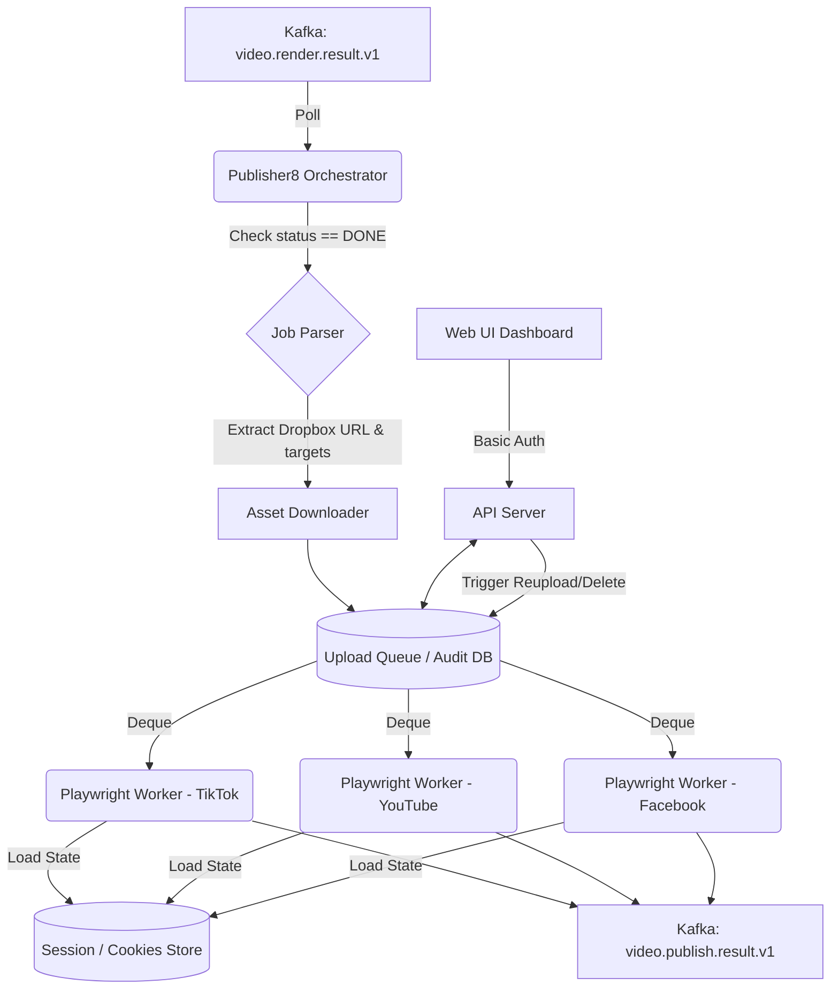

# Software Requirements Specification (SRS): Video Uploader System (Publisher8)

## 1. Giới thiệu (Introduction)

### 1.1 Mục đích (Purpose)
Tài liệu này đặc tả các yêu cầu phần mềm cho Hệ thống tự động upload video (tạm gọi là **Publisher8**), một module độc lập hoặc dịch vụ tiếp nối trong chuỗi xử lý video tự động sau hệ thống **maker8**. Mục tiêu chính là nhận các video đã render thành công và tự động phân phối (publish) lên các nền tảng mạng xã hội: YouTube, Facebook (Reels/Video), và TikTok.

### 1.2 Bối cảnh hệ thống (System Context)
Hệ thống Publisher8 sẽ tích hợp sâu vào quy trình hiện tại:
1. **editor8**: Tạo kịch bản và yêu cầu render.
2. **maker8**: Render video, upload lên Dropbox, và đẩy kết quả (`RenderResult`) vào topic Kafka `video.render.result.v1`.
3. **Publisher8 (Hệ thống mới)**: Lắng nghe topic kết quả, tải video về, và thực hiện upload lên các mục tiêu được chỉ định trong trường `publish_targets`.

---

## 2. Đánh giá giải pháp sử dụng MCP Playwright cho Auto-Upload

### 2.1 Giới thiệu Model Context Protocol (MCP) & Playwright
**Playwright** là công cụ browser automation mạnh mẽ. Khi kết hợp với kiến trúc **MCP** (Model Context Protocol), Playwright có thể đóng vai trò như một tool interface chuẩn hóa, cho phép hệ thống (hoặc AI agent) điều khiển trình duyệt một cách linh hoạt theo ngữ cảnh thay vì hardcode toàn bộ luồng click.

### 2.2 Đánh giá theo từng nền tảng

**1. TikTok**
- **Khả năng API chính thức**: API của TikTok cực kỳ khắt khe, giới hạn quyền truy cập và chủ yếu dành cho các đối tác doanh nghiệp (Enterprise accounts). Việc xin cấp quyền (app approval) cho auto-upload rất khó khăn và tốn thời gian.
- **Khả năng Playwright**: Khả thi và là **lựa chọn bắt buộc đối với hầu hết các dự án automation TikTok**. 
- **Ưu điểm**: Bỏ qua được khâu xét duyệt API; hỗ trợ đầy đủ tính năng: chọn bìa, hashtag, đặt lịch (schedule) như một user thật.
- **Thách thức**: 
  - TikTok có hệ thống anti-bot mạnh. Cần sử dụng phiên bản Stealth của Playwright hoặc quản lý Cookies (Session) thật tốt. 
  - Thỉnh thoảng có CAPTCHA (kéo hình ghép), yêu cầu tích hợp dịch vụ giải CAPTCHA (VD: 2Captcha, CapMonster).

**2. YouTube (Shorts / Standard Video)**
- **Khả năng API chính thức**: YouTube Data API v3 hỗ trợ upload, nhưng rủi ro khóa quota (API Quota) rất lớn nếu vượt quá số lượng nhỏ. Hơn nữa, để upload public cần phải qua vòng audit khắt khe của Google (đánh giá ứng dụng).
- **Khả năng Playwright**: Rất khả thi.
- **Ưu điểm**: Không tốn Quota API đắt đỏ của YouTube Data v3. Không cần qua bước xét duyệt (audit) ứng dụng của Google. Có thể xử lý toàn bộ các tùy chọn trong YouTube Studio: thêm vào playlist, end screen, thay đổi thumbnail tùy chỉnh.
- **Thách thức**: Google login cực kỳ nghiêm ngặt với các trình duyệt tự động (báo lỗi "Bỏ chặn trình duyệt", "Không an toàn"). 
  - *Giải pháp*: Không login bằng Playwright. Hãy login bằng một trình duyệt thật, xuất file Cookies (hoặc lưu dạng Browser Context/Profile), sau đó load lại state này vào Playwright.

**3. Facebook (Reels / Pages)**
- **Khả năng API chính thức**: Facebook Graph API hỗ trợ publish lên Page, tuy nhiên luồng lấy Token (User Token -> Page Token -> Long-lived Page Token) rất phức tạp và thường xuyên rớt (expire) yêu cầu làm mới thủ công. 
- **Khả năng Playwright**: Khả thi thông qua giao diện **Meta Business Suite** hoặc **Creator Studio**. 
- **Ưu điểm**: Đăng chéo (cross-post) lên cả Instagram nếu liên kết tài khoản. Giao diện trực quan, dễ quản lý trạng thái bản nháp (draft) hoặc lên lịch (schedule).
- **Thách thức**: Giao diện Meta Business Suite cập nhật DOM rất linh tinh và thường xuyên, cấu trúc React gen ra các class đổi tên liên tục.
  - *Giải pháp*: Kết hợp Playwright định vị element dựa trên "Text" hoặc "Aria-label" (Accessibility selectors) thay vì XPath hay CSS selectors.

### 2.3 Kết luận về MCP Playwright
Sử dụng Playwright để upload là giải pháp **THỰC TẾ và KHẢ THI NHẤT** để bỏ qua các bài toán xin cấp phép API khó nhằn từ Google, Meta, và ByteDance (TikTok). Tuy nhiên, kiến trúc hệ thống cần chuẩn bị cho:
1. **Cookie/Session Management System**: Lưu trữ và tự động làm mới các browser state.
2. **Stealth Mode**: Dùng các package hỗ trợ qua mặt anti-bot (VD: `playwright-stealth` hoặc `camoufox`).
3. **Resilience & Retry**: Giao diện UI thay đổi là thường xuyên, cần có cơ chế cảnh báo lỗi DOM (Element Timeout) trỏ về hệ thống để admin sớm bảo trì bộ selector. 

---

## 3. Kiến trúc Đề xuất (Proposed Architecture)

---

## 4. Yêu cầu Chức năng (Functional Requirements)

1. **Kafka Integration (Consume)**
   - Topic: `video.render.result.v1`.
   - Consumer group `publisher8-worker`.
   - Phân tích thông tin `publish_targets` (chứa nền tảng, mốc thời gian, tài khoản chỉ định).

2. **Asset Management (File Retrieval)**
   - Tự động download `.mp4` từ Dropbox link vào thư mục `/tmp/publisher8/<job_id>`.

3. **Session Management (Quản lý Phiên)**
   - Lưu trữ các cấu hình Browser State/Cookies từng account (Tiktok của user A, Youtube của user B).
   - Module cho phép admin/user upload bộ cookies mới khi session bị hết hạn (expired).

4. **Multi-Platform Uploader (Playwright Engines)**
   - **Engine TikTok**: Điều khiển giao diện `tiktok.com/creator`. Nhập title, hashtag, chọn bìa.
   - **Engine YouTube**: Điều khiển `studio.youtube.com`. Nhập tiêu đề, mô tả, thẻ, trạng thái (Public/Private/Scheduled).
   - **Engine Facebook**: Điều khiển `business.facebook.com`. Chọn page, upload media, điền caption.

5. **Result Publishing**
   - Publish sự kiện `video.publish.result.v1` với thông tin ID URL của video đã public.
   - Cập nhật database trạng thái Job: `UPLOADED`, `FAILED_LOGIN_REQUIREMENT`, `FAILED_CAPTCHA`.

6. **Audit & Logging**
   - Lưu trữ toàn bộ lịch sử (Audit Log) các job upload thành công / thất bại vào Database.
   - Các trường lưu bao gồm: Thời điểm bắt đầu, Nền tảng đích, Tên tài khoản, Trạng thái, và URL bài đăng (nếu thành công).

7. **Web UI Dashboard (Giao diện quản lý)**
   - Cung cấp giao diện trực quan cho phép người dùng xem danh sách video đã và đang xử lý.
   - Hỗ trợ thao tác **Re-upload** (Thử đăng lại nếu lỗi hoặc đăng lại video cũ) và **Delete** (Xóa video trên nền tảng qua Playwright hoặc xóa khỏi Audit log nội bộ).

8. **Authentication (Xác thực đơn giản)**
   - Bảo mật UI Dashboard và API Server bằng cơ chế xác thực đơn giản (Basic Auth hoặc 1 tài khoản Admin duy nhất có Token).
   - Không yêu cầu phân quyền Role-based phức tạp.

## 5. Yêu cầu Phi chức năng (Non-Functional Requirements)

1. **Khả năng chịu lỗi (Resiliency)**
   - Phải có DLQ (Dead Letter Queue) nếu tải lỗi từ Dropbox.
   - Khi Playwright Timeout (VD trang load chậm), cần tự động retry tối đa 3 lần.

2. **Cách ly ngữ cảnh (Sandbox & Isolation)**
   - Mỗi Uploader Worker chạy trên một Context trình duyệt riêng (`browser.new_context()`), tránh tình trạng cache chéo giữa các tài khoản gây block.

3. **Tài nguyên (Resources)**
   - Khởi chạy một Headless Browser tốn RAM (~300-500MB). Cần cấu hình Worker Scale phù hợp (VD: chạy tối đa 3-5 Playwright job song song trên một container 4GB RAM).
   - Tích hợp tính năng xóa file sau khi publish xong để tiết kiệm Disk Space.

4. **Container hóa (Docker & Deployment)**
   - Bắt buộc hệ thống phải đóng gói thành các Docker container (API, Worker) để triển khai trên mọi môi trường.
   - Môi trường chạy nền (Base Image) phải chứa đầy đủ system font và library để Playwright có thể hoạt động hoàn hảo mà không bị crash hay vỡ layout lúc upload.
